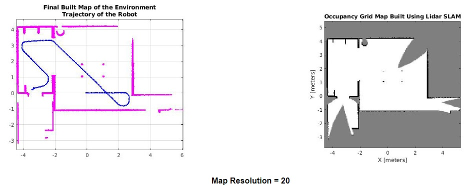

# Control and Navigation of TurtleBot3 ground robots using MATLAB's ROS and Navigation Toolbox

This repository contains MATLAB and C++ codes along with Gazebo files needed to simulate the motion of a robot in an environment with static and dynamic obstacles.

## TurtleBot3

The ground robot used in this project is the [TurtleBot3](https://emanual.robotis.com/docs/en/platform/turtlebot3/overview/). Some of the models of the robot are as shown below:

## Gazebo

[Gazebo](http://gazebosim.org/) is a open-source 3D robotics simulator using which one can simulate a environment as close to the real world as possible. Some of the environment used in this project are as shown below:

## ROS Toolbox

* Provides an interface connecting MATLAB and Simulink with ROS and ROS2, thereby enabling us to create a network of ROS nodes.
* Create, send, and receive messages, topics, and network information.
* Create custom ROS messages.

## Navigation Toolbox

* Provides algorithms and analysis tools for designing the motion planning and navigation systems.
* Can be used to calibrate and simulate IMU, GPS, and range sensors.
* To implement SLAM algorithms with lidar scans.
* Used to create occupancy maps of the environment.

## Simple Navigation

* Subscribe to the odometry data.
* Publish the velocity.
* Set the goal point.
* Find the current orientation (yaw) and calculate the difference in angle between the current position and the goal position.
* Robot will first rotate with a given angular velocity and then travel with a given linear velocity.

A simulation of the robot travelling from (0,0) to (0,5) can be found here: [Position_(0,5)](simulations/Position_(0,5).mp4) and the MATLAB code used for this can be found here: [SimpleNavigation.m](src/SimpleNavigation.m)

## LiDAR Scanner

The TurtleBot3 comes with a 360 Laser Distance Sensor LDS-01 and some of its features are as follows:

* Distance range: 0.12 - 3.5 m
* Sampling rate: 1.8 kHz
* Scan rate: 5 Hz

## Occupancy Map

* Occupancy grids are used to represent a robot workspace as a discrete grid.

* Information about the environment can be collected from the sensors in real-time or can be loaded from prior knowledge.

* The *binaryOccupancyMap* creates a 2D occupancy map object, which can be used to represent and visualize a robot workspace.

* The integration of sensor data and position estimates create a spatial representation of the approximate locations of the obstacles.

 

## Autonomous Navigation

* Subscribe to velocity and laser scan data.

* Create a ROS transformation tree and get the transformation between the */odom* frame and */base_footprint* frame.

* Vector Field Histogram algorithm computes obstacle-free steering directions based on the range sensor readings.

* The user can define certain parameters depending on the type of the robot and the environment. 

  * Robot radius

  * Safety distance

  * Minimum turning radius

  * Distance limits
  
* Code: [AutonomousNavigation.m](src/AutonomousNavigation.m)
* Simulation: [Navigation](simulations/Navigation_1.mp4)

## Map Resolution

* *mapResolution* is a parameter which is defined when building a map from the LiDAR scan data.
* It is the resolution of the occupancy grid map, specified as a positive integer in cells per meter.
* A greater resolution will lead to greater computation time and vice versa.
* Code: [BuildMap](src/BuildMap.m)

## Path Planning Algorithms (RRT and A*)

* A binary occupancy map has to given as an input along with the start and goal points.

* The function finds the optimal path based on the number of minimum and maximum iterations set by the user.

* In both the cases the start point is (35.0, 35.0) and the goal point is (98.0, 98.0).

* MATLAB codes used to obtain the optimal paths: [RRT](src/RRT.m) and [A*](src/Astar.m).

## Multiple Robot Navigation

* Multiple robots can be imported within an environment at desired position and orientation.

* Useful in mapping the entire environment within a short period of time.

* Code: [MulitRobotNavigation](src/MulitRobotNavigation.m)

* Simulation: [MulitRobotNavigation_House](simulations/MulitRobot_Navigation_House.mp4) and [MulitRobotNavigation_Cafe](src/5RobotNavigation.mp4)

## Map Merge

 

